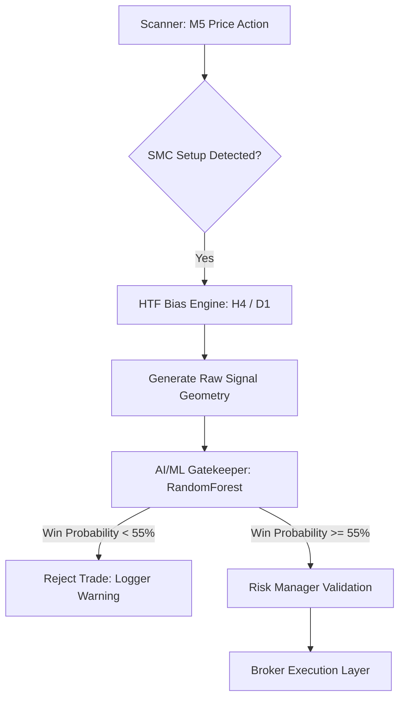

# 🤖 V2 Upgrade: Multi-Timeframe Bias & AI/ML Gatekeeper

This document details the architecture, design decisions, and usage instructions for the **V2 Multi-Timeframe Backtester** and **AI/ML Probability Gatekeeper** integrated into the ICT/SMC Institutional Scalping Bot.

---

## 🏛️ System Overview

The V2 upgrade introduces structural context and machine learning filters to solve the high-frequency drawdown problem in retail automated strategies. By combining multi-timeframe structural bias with a predictive AI gate, the bot achieves high selectivity, protecting capital during choppy, low-probability sessions.



---

## 🔬 Component Breakdown

### 1. Multi-Timeframe Context Engine
The scanner now queries and processes three key timeframes concurrently to build a comprehensive view of the market trend and institutional order flow:
- **D1 (Daily)**: Long-term directional bias (determined via daily candle structure, swing points, and daily FVG direction).
- **H4 (4-Hour)**: Medium-term trend structure and key institutional liquidity zones.
- **M5 (5-Minute)**: The execution timeframe where liquidity sweeps, breaks of structure (BOS), and FVG/Order Blocks are scanned for entry signals.

**Scanner Integration:**
When a signal is generated, the daily and H4 contexts are injected into `signal.indicators`:
```json
{
  "h4_bias": "BULLISH",
  "d1_bias": "BULLISH",
  "day_of_week": "Wednesday",
  "hour_of_day": 14
}
```

### 2. V2 Walk-Forward Backtester (`backtest/engine_v2.py`)
To prevent look-ahead bias and accurately reflect live execution conditions, the new V2 Backtester simulates a live walk-forward setup:
- **HTF Bias Injection**: Injects Daily and H4 bias dynamically at each timestamp without looking into future candles.
- **ML Dataset Generation**: Automatically logs every detected setup (both winners and losers) to `logs/ml_training_data.csv`.
- **Comprehensive Features**: Collects trade geometry (entry_pips, stop_loss_pips, take_profit_pips, risk_reward), temporal features (hour, day), and structural indicators (spread, FVG size, sweep size) for training.

### 3. AI/ML probability Gatekeeper (`src/ml/model.py`)
The AI engine acts as a **final safety filter** that sits between signal generation and order placement. It evaluates the probability of a setup resulting in a win, using a trained Random Forest model.

> [!IMPORTANT]
> **Core Safety Principle**: The machine learning model is strictly a **filter**. It is never allowed to modify trade geometry (entry price, stop loss, take profit). It can only **approve** or **reject** a strategy-defined trade setup.

- **Threshold**: The AI Gate requires a predicted win probability of **`>= 55%`** to pass. Setups scoring lower are rejected, and a detailed warning is logged.
- **Fail-Closed Strategy**: If a model feature is missing or input is corrupted, the trade fails closed (rejection).
- **Fail-Open Bootstrap Fallback**: If the model files are not yet trained (`rf_model.pkl` is missing), the engine returns a default probability of `1.0` (Pass) with a warning log, ensuring the bot's core trading execution remains functional during bootstrapping.

---

## 🛠️ Usage & Operations

### Generating the Training Dataset
To generate three months of training data across all major pairs, run:
```bash
python run_backtest_v2.py
```
This script queries data from the MT5 terminal and exports a dataset including:
- **Features**: `pair`, `hour_of_day`, `day_of_week`, `entry_type`, `risk_reward`, `stop_loss_pips`, `take_profit_pips`, `spread`, `h4_bias`, `d1_bias`.
- **Target**: `is_win` (1 for TP hit, 0 for SL hit).

### Training the AI Model
Once the dataset is generated, run the training pipeline:
```bash
python train_ml.py
```
This trains a **Random Forest Classifier** and saves the following artifacts to `src/ml/models/`:
1. `rf_model.pkl` - The trained classifier.
2. `scaler.pkl` - MinMaxScaler for numeric features.
3. `encoders.pkl` - OneHotEncoders for categorical features (pair, entry_type, biases).

### Monitoring in Live Trading
In `logs/bot.log`, you will see the ML Gatekeeper actively audit every incoming trade:

```text
16:35:53 | INFO     | 🔎 Scanner: Detected BULLISH SMC_FVG setup on EURUSD (M5)
16:35:54 | INFO     | 🤖 AI Gatekeeper: Auditing EURUSD setup...
16:35:54 | WARNING  | ❌ AI Gatekeeper: Setup rejected. Win probability 42.6% is below threshold (55.0%).
```

If a high-probability trade is detected:
```text
16:36:14 | INFO     | 🔎 Scanner: Detected BULLISH SMC_FVG setup on GBPUSD (M5)
16:36:15 | INFO     | 🤖 AI Gatekeeper: Auditing GBPUSD setup...
16:36:15 | INFO     | ✅ AI Gatekeeper: Setup APPROVED! Win probability: 74.2%
16:36:15 | INFO     | 💰 Risk Manager: Trade size: 1.25 lots (1.0% Risk, $100 max)
16:36:15 | INFO     | 🚀 Broker: Placing BUY LIMIT on GBPUSD at 1.26450
```

---

## 🛡️ Risk & Safety Controls

1. **Backtest Parity**: The ML Gatekeeper uses the exact same feature extraction logic in both the live execution loop (`src/bot.py`) and the walk-forward backtester (`backtest/engine_v2.py`).
2. **Feature Alignment**: Any new feature added to the live bot scanner must also be logged in the backtest engine; otherwise, the ML model will encounter dimension mismatch errors.
3. **No Overfitting**: The training pipeline splits data into training/testing sets, outputs performance metrics (Accuracy, ROC-AUC), and logs feature importances so developers can audit which factors drive profitability.
