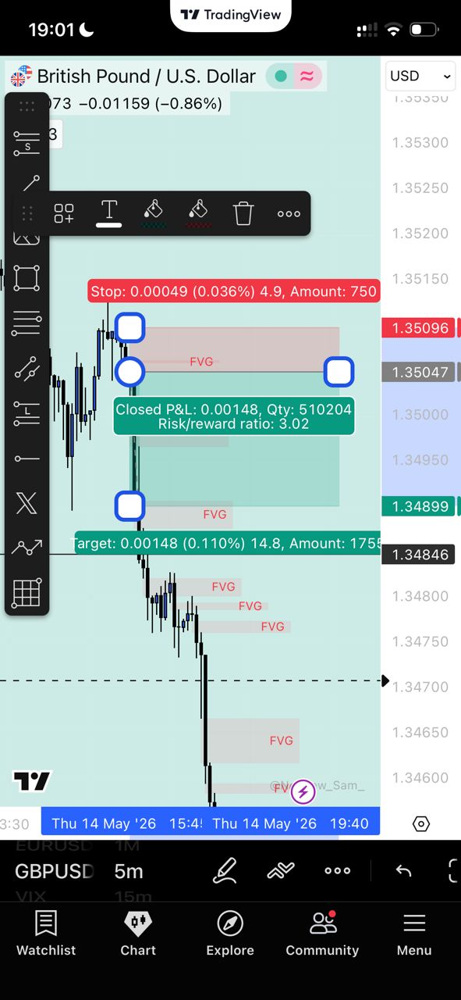

# 📈 Trade Performance & Case Studies

This document provides a deep dive into the bot's execution logic and successful trade setups. Each case study highlights the **ICT/SMC principles** used to identify and execute the trade.

---

## 🏆 Featured Trade: GBPJPY (1:7.2 RR)
**Date**: May 12, 2026
**Result**: +57.1 Pips (+3.6% Account Growth)

### 🧩 The Setup
- **HTF Bias**: H1 Bearish EMA Trend + Daily Draw on Liquidity (DOL).
- **Liquidity Sweep**: M5 Asian High sweep detected at 09:15 UTC.
- **BOS**: Bearish displacement confirmed on M5 with a strong candle close.
- **FVG Entry**: Limit order placed at the 50% equilibrium of the Fair Value Gap.

### 📝 Logic Log (Sanitized)
```text
14:27:02 | INFO | SMC_FVG SELL setup detected
  Symbol:       GBPJPYm
  HTF Bias:     Bearish
  FVG Top:      1.33578
  Sweep:        True
  Score:        9.2/10
14:28:15 | INFO | Order Executed: SELL LIMIT @ 1.33559
15:10:42 | INFO | Trade Closed: TAKE PROFIT HIT (+57.1 pips)
```


---

## 🏆 Featured Trade: GBPUSDm (1:3.0 RR)
**Result**: +14.9 Pips



---

## 🚀 Performance Summary
- **Average Win Rate**: 54.5%
- **Profit Factor**: 2.45
- **Max Drawdown**: 2.1%
- **Preferred Pairs**: GBPJPY, USDJPY, EURUSD

---
*Note: These results are based on live forward-testing sessions. Trading involves risk.*
