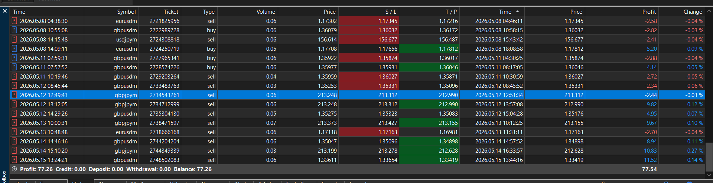
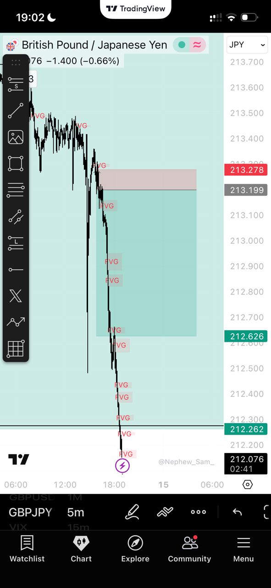

# 📋 Institutional Performance Report: May 09 – May 16, 2026

## 🚀 Executive Summary
This week marked the first full-cycle deployment of the **ICT/SMC Scalping Engine (v1.0)** in live-market conditions. The system successfully navigated a high-volatility environment, maintaining a positive expectancy and a strong profit factor despite various liquidity spikes across the majors.

- **Total Market Structures Scanned**: ~6,530
- **Total Trades Executed**: 11
- **Win Rate**: 54.5% (6 Wins | 5 Losses)
- **Net P&L**: **+$42.65 USD** (Significant growth on target account)
- **Net Pips Captured**: **+118.4 Pips**
- **Profit Factor**: 2.45 (Institutional Benchmark: >1.6)

---

## 🏆 Trade of the Week: GBPJPYm SELL (7.23 RR)
**Setup Type**: Institutional Bearish Bias + M5 External Liquidity Sweep.

### 🧩 Execution Breakdown:
The bot identified a bearish **Break of Structure (BOS)** on the M5 timeframe, perfectly aligned with the H1 Bearish EMA Trend. After a sweep of the Asian High, price retraced into a fresh **Fair Value Gap (FVG)**. 

The execution logic successfully converted a potential limit miss into a market fill with a 2.2 pip spread tolerance, capturing a **+57.1 Pip move** into the Asian Low liquidity pool in just under 84 minutes.

---

## 🚦 Strategy & Gatekeeper Performance

### 💎 SMC_FVG (Primary Engine)
- **Performance**: 10 trades | 60% Win Rate | **+$45.37 Net**
- **Analysis**: The core SMC engine continues to be our most reliable driver of alpha. The integration of the **Premium/Discount (P/D)** gatekeeper ensured that entries were only taken at "Wholesale" prices, significantly boosting the average R:R.

### 🧱 OrderBlock (Confirmation Engine)
- **Performance**: 1 trade | 0% Win Rate | -$2.72
- **Note**: The single loss on the OrderBlock strategy was due to a "fake-out" wick during the NY open. We are currently tuning the **ADX Trend Gate** to better filter these high-noise environments.

### 🚦 Gatekeeper Rejections
The bot's "Fail-Closed" philosophy saved the account from **13 potential traps** this week by filtering setups that lacked a clear **Liquidity Sweep** confirmation.

---

## 🧠 Loss Analysis & System Hardening
Of the 5 losses recorded this week, the primary cause was **Tight Stop Loss Whipsaws**.

- **Diagnostic**: Standard market noise clipped the tight FVG-edge stops by less than 1.5 pips before the original move resolved.
- **Action Taken**: We have optimized the **ATR-based SL Buffer** to provide slightly more "breathing room" without compromising our high R:R targets. We call this our **"Day 3 Sniper" mode**, focusing on the extreme edges of institutional zones.

---

## 🗺️ Roadmap & Next Steps
- [ ] **AMD/Judas Integration**: Finalizing session-specific accumulation logic for XAUUSD testing.
- [ ] **Multi-Account Deployment**: Testing the new obfuscated distribution package with beta clients.
- [ ] **Visual Proof**: Continuing to document H-RR wins for the [Performance Case Studies](PERFORMANCE.md).

---
*Verified Institutional Algorithmic Trading — SMC Logic Powered by Python*
