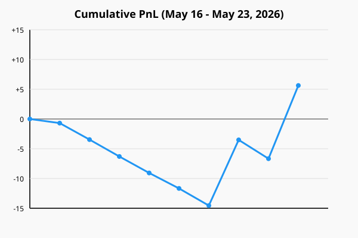

# Weekly Trading Report (May 16 - May 23, 2026)

## Performance Summary
- **Total Trades:** 9
- **Wins:** 2
- **Losses:** 7
- **Win Rate:** 22.22%
- **Total PnL:** +$5.63

## PnL Chart

## Trade Details
| Ticket | Symbol | Direction | Strategy | Open Time | Close Time | PnL | Reasoning |
| --- | --- | --- | --- | --- | --- | --- | --- |
| 2754277261 | EURUSDm | SELL | AMD_Judas | 2026-05-18 13:06:34 | 2026-05-18 13:35:05 | -$0.69 | AMD_Judas signal on EURUSDm SELL. H1 trend: neutral. RSI: 50, ADX: 0. |
| 2756212422 | GBPJPYm | BUY | SMC_FVG | 2026-05-18 19:29:11 | 2026-05-18 22:07:29 | -$2.77 | Bullish BOS detected on M5 with price retracing into an active Fair Value Gap (FVG) zone. |
| 2758985151 | GBPUSDm | BUY | AMD_Judas | 2026-05-19 13:34:53 | 2026-05-19 14:08:38 | -$2.84 | AMD_Judas signal on GBPUSDm BUY. H1 trend: bullish. RSI: 50, ADX: 0. |
| 2759497664 | USDJPYm | BUY | SMC_FVG | 2026-05-19 14:40:05 | 2026-05-19 14:50:32 | -$2.77 | Bullish BOS detected on M5 with price retracing into an active Fair Value Gap (FVG) zone. |
| 2762885972 | GBPUSDm | SELL | SMC_FVG | 2026-05-20 10:33:20 | 2026-05-20 11:19:34 | -$2.60 | Bearish BOS detected on M5 with price retracing into an active Fair Value Gap (FVG) zone. |
| 2767138158 | EURUSDm | BUY | SMC_FVG | 2026-05-21 11:08:56 | 2026-05-21 11:26:46 | -$2.88 | Bullish BOS detected on M5 with price retracing into an active Fair Value Gap (FVG) zone. |
| 2771930164 | GBPUSDm | BUY | OrderBlock | 2026-05-22 13:27:02 | 2026-05-22 14:10:05 | +$11.04 | ICT Bullish Order Block identified on M5 — last bearish candle before strong bullish impulse. |
| 2772637999 | EURUSDm | SELL | SMC_FVG | 2026-05-22 15:30:06 | 2026-05-22 17:11:58 | -$3.16 | Bearish BOS detected on M5 with price retracing into an active Fair Value Gap (FVG) zone. |
| 2772443947 | GBPUSDm | BUY | SMC_FVG | 2026-05-22 15:04:16 | 2026-05-22 17:30:53 | +$12.30 | Bullish BOS detected on M5 with price retracing into an active Fair Value Gap (FVG) zone. |
